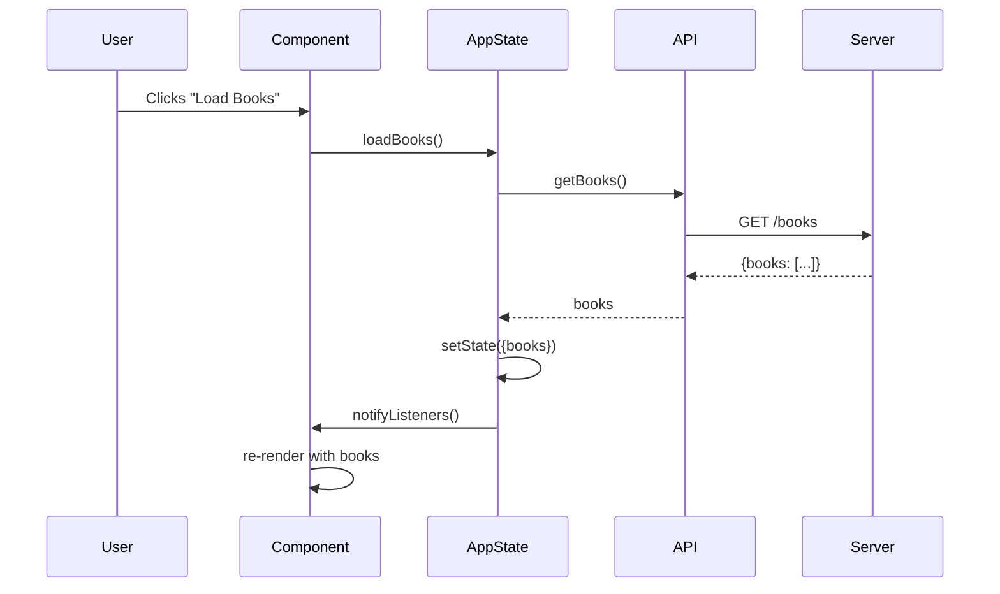

The Dust client is a modern web application built with Lit (Web Components), TypeScript, and Vite. It provides a responsive, component-based UI for browsing and reading books.

## Technology Stack

- **Framework**: [Lit 3.x](https://lit.dev/) - Lightweight web components library
- **Language**: TypeScript with strict type checking
- **State Management**: Custom reactive service pattern with Lit Context
- **Readers**: PDF.js for PDFs, epub.js for EPUBs
- **Build Tool**: Vite for fast development and optimized production builds

## Architecture Overview

```
client/src/
├── main.ts              # Application entry point
├── components/          # Lit web components
│   ├── dust-app.ts     # Root application component
│   ├── dust-library.ts # Book library grid
│   ├── dust-reader.ts  # Book reader (PDF/EPUB)
│   └── ...
├── services/           # Business logic and state
│   ├── app-state.ts   # Global application state
│   ├── api.ts         # REST API client
│   ├── server-manager.ts  # Multi-server support
│   ├── pdf-reader.ts  # PDF rendering service
│   └── epub-reader.ts # EPUB rendering service
└── types/             # TypeScript type definitions
    ├── app.ts
    ├── api.ts
    └── server.ts
```

## Core Concepts

### Web Components with Lit

Dust uses Lit to create reusable, encapsulated web components:

```typescript
import { LitElement, html, css } from 'lit';
import { customElement, state } from 'lit/decorators.js';

@customElement('dust-library')
export class DustLibrary extends LitElement {
  @state() books: Book[] = [];
  
  static styles = css`
    :host {
      display: grid;
      grid-template-columns: repeat(auto-fill, minmax(200px, 1fr));
      gap: 1rem;
    }
  `;
  
  render() {
    return html`
      ${this.books.map(book => html`
        <book-card .book=${book}></book-card>
      `)}
    `;
  }
}
```

Benefits:
- **Encapsulation**: Components have isolated styles and behavior
- **Reusability**: Components can be used anywhere in the app
- **Performance**: Efficient rendering with Lit's reactive update system
- **Standards-based**: Built on web component standards

### State Management

Dust uses a service-based state management pattern with Lit Context API.

#### Application State Service (`client/src/services/app-state.ts`)

The `AppStateService` is a singleton that manages global application state:

```typescript
export class AppStateService {
  private state: AppState = {
    user: null,
    isAuthenticated: false,
    isLoading: false,
    theme: 'auto',
    currentBook: null,
    readingProgress: new Map()
  };
  
  private listeners = new Set<() => void>();
  
  // Subscribe to state changes
  subscribe(listener: () => void): () => void {
    this.listeners.add(listener);
    return () => this.listeners.delete(listener);
  }
  
  // Update state and notify listeners
  private setState(updates: Partial<AppState>): void {
    this.state = { ...this.state, ...updates };
    this.notifyListeners();
  }
}
```

#### Context API Integration

Components access state via Lit's Context API:

```typescript
import { consume } from '@lit/context';
import { appStateContext } from './services/app-state.js';

@customElement('dust-app')
export class DustApp extends LitElement {
  @consume({ context: appStateContext, subscribe: true })
  appStateService!: AppStateService;
  
  async connectedCallback() {
    super.connectedCallback();
    const state = this.appStateService.getState();
    // Component automatically re-renders when state changes
  }
}
```

<Info>
The Context API provides dependency injection for services, making components testable and decoupled from global state.
</Info>

## Key Services

### API Service (`client/src/services/api.ts`)

The `ApiService` handles all HTTP communication with the server:

```typescript
export class ApiService {
  private async request<T>(endpoint: string, options: RequestInit = {}): Promise<T> {
    const server = this.getCurrentServer();
    const token = this.getCurrentToken();
    
    const url = `${server.baseUrl}${endpoint}`;
    const headers = {
      'Content-Type': 'application/json',
      ...(token && { Authorization: `Bearer ${token}` })
    };
    
    const response = await fetch(url, { ...options, headers });
    if (!response.ok) throw new ApiError(...);
    return response.json();
  }
  
  // Authentication
  async login(credentials: LoginRequest): Promise<LoginResponse>
  async logout(): Promise<void>
  async register(userData: CreateUserRequest): Promise<User>
  
  // Books
  async getBooks(filters?: BookFilters): Promise<{ books: Book[] }>
  async getBook(id: number): Promise<{ book: Book }>
  async streamBook(id: number): Promise<Response>
  
  // Reading Progress
  async getReadingProgress(bookId: number): Promise<ReadingProgress>
  async updateReadingProgress(bookId: number, ...): Promise<void>
}
```

Features:
- Centralized error handling
- Automatic authentication header injection
- Type-safe request/response handling
- Multi-server support via ServerManager

### Server Manager (`client/src/services/server-manager.ts`)

<Note>
Dust supports connecting to multiple servers, allowing users to manage libraries across different instances.
</Note>

The `ServerManager` handles multi-server configuration:

```typescript
export class ServerManager {
  private state: MultiServerState = {
    servers: [],
    activeServerId: null,
    isConnecting: false
  };
  
  // Server management
  async addServer(config: ServerConfig): Promise<ServerConnectionResult>
  async removeServer(serverId: string): Promise<void>
  async switchServer(serverId: string): Promise<void>
  
  // Authentication
  async authenticateWithServer(serverId: string, email: string, password: string)
  
  // Get active server
  getActiveServer(): ServerWithAuth | null
}
```

Server configuration is persisted in localStorage:
- `dust_servers` - Server list
- `dust_auth_tokens` - Authentication tokens per server
- `dust_active_server` - Currently active server ID

### Reader Services

#### PDF Reader (`client/src/services/pdf-reader.ts`)

Wraps PDF.js for rendering PDF documents:

```typescript
export class PdfReader {
  private pdf: any = null;
  private currentPage = 1;
  private totalPages = 0;
  private scale = 1.0;
  
  async loadFromUrl(url: string, headers: Record<string, string>): Promise<void>
  async renderTo(container: HTMLElement): Promise<void>
  
  // Navigation
  nextPage(): void
  previousPage(): void
  goToPage(pageNum: number): void
  
  // Display
  setScale(scale: number): void
  refresh(): Promise<void>
  
  // Progress tracking
  getPageInfo(): { currentPage, totalPages, scale }
}
```

Features:
- Page-based navigation with keyboard shortcuts
- Zoom controls
- Responsive rendering
- Progress callbacks for reading progress tracking
- Vim-style navigation (h/j/k/l, g/G)

#### EPUB Reader (`client/src/services/epub-reader.ts`)

Wraps epub.js for EPUB rendering:

```typescript
export class EpubReaderService {
  private book: Book | null = null;
  private rendition: Rendition | null = null;
  
  async loadBook(source: string | ArrayBuffer, headers?: Record<string, string>)
  async renderTo(container: HTMLElement): Promise<void>
  
  // Navigation
  async nextPage(): Promise<void>
  async prevPage(): Promise<void>
  async goTo(target: string | number): Promise<void>
  async goToPercentage(percentage: number): Promise<void>
  
  // Metadata
  async getTableOfContents(): Promise<EpubChapter[]>
  async getMetadata(): Promise<EpubMetadata>
  
  // Customization
  setFontSize(size: number): void
  setFontFamily(family: string): void
  setTheme(theme: 'light' | 'dark' | 'sepia'): void
  
  // Progress
  getCurrentPosition(): ReadingPosition | null
}
```

Features:
- Reflowable text with customizable fonts and themes
- Table of contents navigation
- Search functionality
- Location-based progress tracking (CFI)
- Click zones for navigation

## Component Architecture

### Root Component (`client/src/components/dust-app.ts`)

The `dust-app` component is the application shell:

```typescript
@customElement('dust-app')
export class DustApp extends LitElement {
  @consume({ context: appStateContext, subscribe: true })
  appStateService!: AppStateService;
  
  @state() private currentView: 'library' | 'reader' | 'login' = 'library';
  
  render() {
    const state = this.appStateService.getState();
    
    if (!state.isAuthenticated) {
      return html`<dust-login></dust-login>`;
    }
    
    return html`
      <dust-header></dust-header>
      ${this.renderView()}
    `;
  }
  
  private renderView() {
    switch (this.currentView) {
      case 'library': return html`<dust-library></dust-library>`;
      case 'reader': return html`<dust-reader></dust-reader>`;
      default: return html`<dust-library></dust-library>`;
    }
  }
}
```

### Library Component

Displays the book grid:

```typescript
@customElement('dust-library')
export class DustLibrary extends LitElement {
  @consume({ context: appStateContext })
  appStateService!: AppStateService;
  
  @state() books: Book[] = [];
  @state() loading = false;
  
  async connectedCallback() {
    super.connectedCallback();
    await this.loadBooks();
  }
  
  private async loadBooks() {
    this.loading = true;
    this.books = await this.appStateService.loadBooks();
    this.loading = false;
  }
  
  render() {
    if (this.loading) return html`<loading-spinner></loading-spinner>`;
    
    return html`
      <div class="library-grid">
        ${this.books.map(book => html`
          <book-card 
            .book=${book}
            @click=${() => this.openBook(book)}
          ></book-card>
        `)}
      </div>
    `;
  }
}
```

### Reader Component

Handles PDF and EPUB rendering:

```typescript
@customElement('dust-reader')
export class DustReader extends LitElement {
  @state() book: Book | null = null;
  @state() format: 'pdf' | 'epub' = 'pdf';
  
  private pdfReader?: PdfReader;
  private epubReader?: EpubReaderService;
  
  async openBook(book: Book) {
    this.book = book;
    this.format = book.file_format as 'pdf' | 'epub';
    
    const response = await apiService.streamBook(book.id);
    const blob = await response.blob();
    const url = URL.createObjectURL(blob);
    
    if (this.format === 'pdf') {
      this.pdfReader = new PdfReader({
        onPageChange: (info) => this.updateProgress(info)
      });
      await this.pdfReader.loadFromUrl(url);
      await this.pdfReader.renderTo(this.readerContainer!);
    } else {
      this.epubReader = new EpubReaderService();
      this.epubReader.on('location-changed', (pos) => this.updateProgress(pos));
      await this.epubReader.loadBook(await blob.arrayBuffer());
      await this.epubReader.renderTo(this.readerContainer!);
    }
  }
  
  private async updateProgress(info: any) {
    await appState.updateReadingProgress({
      book_id: this.book!.id,
      current_page: info.currentPage || info.page,
      total_pages: info.totalPages,
      percentage_complete: info.percentage,
      ...
    });
  }
}
```

## Data Flow



## Routing

Dust uses client-side routing via URL hash:

```typescript
window.location.hash = '#/library';
window.location.hash = '#/reader/123';
window.location.hash = '#/settings';
```

Route handling in the root component:

```typescript
connectedCallback() {
  super.connectedCallback();
  window.addEventListener('hashchange', () => this.handleRoute());
  this.handleRoute();
}

private handleRoute() {
  const hash = window.location.hash.slice(1);
  if (hash.startsWith('/reader/')) {
    const bookId = parseInt(hash.split('/')[2]);
    this.openReader(bookId);
  } else if (hash === '/library') {
    this.currentView = 'library';
  }
}
```

## Build and Development

### Development

```bash
cd client
npm install
npm run dev    # Start Vite dev server on port 5173
```

Vite provides:
- Hot module replacement (HMR)
- Fast TypeScript compilation
- Automatic browser refresh

### Production Build

```bash
npm run build  # Outputs to client/dist/
```

Production optimizations:
- Code minification
- Tree shaking
- Asset optimization
- CSS bundling

The server serves the built client from `client/dist/` via the StaticFileServer.