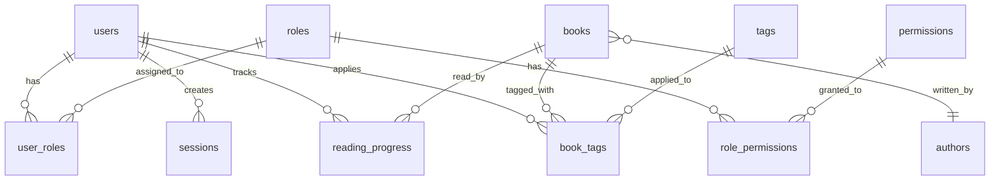

Dust uses SQLite as its database, with a normalized schema supporting users, books, reading progress, and permissions.

## Schema Overview

The database schema is organized into three main domains:

1. **Users & Authentication** - User accounts, roles, permissions, sessions
2. **Books & Media** - Books, authors, tags, and categorization
3. **Reading Tracking** - Reading progress and statistics

## Migration System

Dust uses a migration-based schema management system. Migrations are tracked in the `migrations` table:

```sql
CREATE TABLE migrations (
  id INTEGER PRIMARY KEY AUTOINCREMENT,
  name TEXT NOT NULL UNIQUE,
  applied_at TIMESTAMP DEFAULT CURRENT_TIMESTAMP
);
```

Migrations are defined in:
- `src/modules/users/migrations.zig` - User and auth schema
- `src/modules/books/migrations.zig` - Books and media schema

## Users & Authentication Domain

### Users Table

Stores user account information:

```sql
CREATE TABLE users (
  id INTEGER PRIMARY KEY AUTOINCREMENT,
  email TEXT NOT NULL UNIQUE,
  username TEXT,
  password_hash TEXT NOT NULL,
  is_admin INTEGER DEFAULT 0 NOT NULL,
  created_at TIMESTAMP DEFAULT CURRENT_TIMESTAMP,
  updated_at TIMESTAMP DEFAULT CURRENT_TIMESTAMP
);

CREATE INDEX idx_users_email ON users(email);
```

**Key fields:**
- `email` - Unique email for login (indexed)
- `password_hash` - Bcrypt hashed password
- `is_admin` - Boolean flag for admin users
- `username` - Optional display name

**Source:** `src/modules/users/migrations.zig:6-19`

### Roles Table

Defines user roles in the system:

```sql
CREATE TABLE roles (
  id INTEGER PRIMARY KEY AUTOINCREMENT,
  name TEXT NOT NULL UNIQUE,
  description TEXT,
  created_at TIMESTAMP DEFAULT CURRENT_TIMESTAMP
);
```

**Default roles:**
- `admin` - Administrator with full access
- `user` - Regular user with basic access
- `guest` - Guest with limited access

**Source:** `src/modules/users/migrations.zig:23-35`

### Permissions Table

Defines granular permissions:

```sql
CREATE TABLE permissions (
  id INTEGER PRIMARY KEY AUTOINCREMENT,
  name TEXT NOT NULL UNIQUE,
  description TEXT,
  resource TEXT NOT NULL,
  action TEXT NOT NULL,
  created_at TIMESTAMP DEFAULT CURRENT_TIMESTAMP
);

CREATE INDEX idx_permissions_resource_action ON permissions(resource, action);
```

**Default permissions:**
- `books.read` - Read books
- `books.write` - Create and edit books
- `books.delete` - Delete books
- `users.read` - View users
- `users.write` - Create and edit users
- `users.manage` - Manage user roles and permissions
- `admin.full` - Full administrative access
- `system.admin` - System administration

**Source:** `src/modules/users/migrations.zig:39-63`

### Role Permissions (Junction Table)

Links roles to their permissions:

```sql
CREATE TABLE role_permissions (
  role_id INTEGER NOT NULL,
  permission_id INTEGER NOT NULL,
  PRIMARY KEY (role_id, permission_id),
  FOREIGN KEY (role_id) REFERENCES roles(id) ON DELETE CASCADE,
  FOREIGN KEY (permission_id) REFERENCES permissions(id) ON DELETE CASCADE
);
```

**Source:** `src/modules/users/migrations.zig:67-84`

### User Roles (Junction Table)

Links users to their roles:

```sql
CREATE TABLE user_roles (
  user_id INTEGER NOT NULL,
  role_id INTEGER NOT NULL,
  PRIMARY KEY (user_id, role_id),
  FOREIGN KEY (user_id) REFERENCES users(id) ON DELETE CASCADE,
  FOREIGN KEY (role_id) REFERENCES roles(id) ON DELETE CASCADE
);
```

**Source:** `src/modules/users/migrations.zig:88-98`

### Sessions Table

Tracks active JWT sessions:

```sql
CREATE TABLE sessions (
  id INTEGER PRIMARY KEY AUTOINCREMENT,
  user_id INTEGER NOT NULL,
  token TEXT NOT NULL UNIQUE,
  expires_at TIMESTAMP NOT NULL,
  created_at TIMESTAMP DEFAULT CURRENT_TIMESTAMP,
  FOREIGN KEY (user_id) REFERENCES users(id) ON DELETE CASCADE
);

CREATE INDEX idx_sessions_token ON sessions(token);
CREATE INDEX idx_sessions_user_id ON sessions(user_id);
```

**Source:** `src/modules/users/migrations.zig:102-116`

### Server Settings Table

Stores global server configuration:

```sql
CREATE TABLE server_settings (
  id INTEGER PRIMARY KEY CHECK (id = 1),
  auth_flow TEXT NOT NULL DEFAULT 'signup' CHECK (auth_flow IN ('signup', 'invitation')),
  updated_at TIMESTAMP DEFAULT CURRENT_TIMESTAMP
);

INSERT INTO server_settings (id, auth_flow) VALUES (1, 'signup');
```

**Fields:**
- `auth_flow` - Authentication mode: `signup` (open registration) or `invitation` (invite-only)

<Note>
The `CHECK (id = 1)` constraint ensures only one settings record exists (singleton pattern).
</Note>

**Source:** `src/modules/users/migrations.zig:126-137`

## Books & Media Domain

### Books Table

Core book metadata and file information:

```sql
CREATE TABLE books (
  id INTEGER PRIMARY KEY AUTOINCREMENT,
  name TEXT NOT NULL,
  author INTEGER NOT NULL,
  file_path TEXT NOT NULL UNIQUE,
  isbn TEXT,
  publication_date TEXT,
  publisher TEXT,
  description TEXT,
  page_count INTEGER,
  file_size INTEGER,
  file_format TEXT,
  cover_image_path TEXT,
  status TEXT DEFAULT 'active',
  archived_at DATETIME,
  archive_reason TEXT,
  created_at DATETIME DEFAULT CURRENT_TIMESTAMP,
  updated_at DATETIME DEFAULT CURRENT_TIMESTAMP,
  FOREIGN KEY (author) REFERENCES authors(id)
);
```

**Key fields:**
- `file_path` - Absolute path to book file (unique)
- `file_format` - File type (pdf, epub)
- `status` - Book status (active, archived)
- `cover_image_path` - Path to cached cover image
- `author` - Foreign key to authors table

**Source:** `src/modules/books/migrations.zig:6-29`

### Authors Table

Author information and metadata:

```sql
CREATE TABLE authors (
  id INTEGER PRIMARY KEY AUTOINCREMENT,
  name TEXT NOT NULL,
  biography TEXT,
  birth_date TEXT,
  death_date TEXT,
  nationality TEXT,
  image_url TEXT,
  wikipedia_url TEXT,
  goodreads_url TEXT,
  website TEXT,
  aliases TEXT,
  genres TEXT,
  created_at DATETIME DEFAULT CURRENT_TIMESTAMP,
  updated_at DATETIME DEFAULT CURRENT_TIMESTAMP
);
```

**Source:** `src/modules/books/migrations.zig:32-52`

### Tags Table

Flexible tagging system for categorization:

```sql
CREATE TABLE tags (
  id INTEGER PRIMARY KEY AUTOINCREMENT,
  name TEXT NOT NULL UNIQUE,
  category TEXT NOT NULL,
  description TEXT,
  color TEXT,
  requires_permission TEXT,
  created_at DATETIME DEFAULT CURRENT_TIMESTAMP
);
```

**Fields:**
- `name` - Tag name (unique)
- `category` - Tag category (e.g., "genre", "status", "custom")
- `color` - Hex color code for UI display
- `requires_permission` - Optional permission required to apply tag

**Source:** `src/modules/books/migrations.zig:55-68`

### Book Tags (Junction Table)

Links books to their tags:

```sql
CREATE TABLE book_tags (
  book_id INTEGER NOT NULL,
  tag_id INTEGER NOT NULL,
  applied_at DATETIME DEFAULT CURRENT_TIMESTAMP,
  applied_by INTEGER,
  auto_applied BOOLEAN DEFAULT FALSE,
  PRIMARY KEY (book_id, tag_id),
  FOREIGN KEY (book_id) REFERENCES books(id) ON DELETE CASCADE,
  FOREIGN KEY (tag_id) REFERENCES tags(id) ON DELETE CASCADE,
  FOREIGN KEY (applied_by) REFERENCES users(id)
);
```

**Audit fields:**
- `applied_by` - User who applied the tag
- `auto_applied` - Whether tag was automatically applied (e.g., from metadata)

**Source:** `src/modules/books/migrations.zig:71-86`

## Reading Tracking Domain

### Reading Progress Table

Tracks per-user reading progress:

```sql
CREATE TABLE reading_progress (
  id INTEGER PRIMARY KEY AUTOINCREMENT,
  user_id INTEGER NOT NULL,
  book_id INTEGER NOT NULL,
  current_page INTEGER DEFAULT 0,
  total_pages INTEGER,
  percentage_complete REAL DEFAULT 0.0,
  last_read_at DATETIME DEFAULT CURRENT_TIMESTAMP,
  created_at DATETIME DEFAULT CURRENT_TIMESTAMP,
  updated_at DATETIME DEFAULT CURRENT_TIMESTAMP,
  UNIQUE(user_id, book_id),
  FOREIGN KEY (user_id) REFERENCES users(id) ON DELETE CASCADE,
  FOREIGN KEY (book_id) REFERENCES books(id) ON DELETE CASCADE
);
```

**Key fields:**
- `current_page` - Current reading position
- `total_pages` - Total pages in book
- `percentage_complete` - Stored as 0.0-1.0 (decimal)
- `last_read_at` - Timestamp of last reading activity

<Info>
The `UNIQUE(user_id, book_id)` constraint ensures one progress record per user per book.
</Info>

**Source:** `src/modules/books/migrations.zig:89-108`

## Entity Relationships



## Common Queries

### Get User with Permissions

```sql
SELECT DISTINCT p.name as permission
FROM users u
JOIN user_roles ur ON u.id = ur.user_id
JOIN role_permissions rp ON ur.role_id = rp.role_id
JOIN permissions p ON rp.permission_id = p.id
WHERE u.id = ?;
```

### Get Books with Reading Progress

```sql
SELECT 
  b.*,
  a.name as author_name,
  rp.current_page,
  rp.total_pages,
  rp.percentage_complete * 100 as percentage
FROM books b
JOIN authors a ON b.author = a.id
LEFT JOIN reading_progress rp ON b.id = rp.book_id AND rp.user_id = ?
WHERE b.status = 'active'
ORDER BY b.created_at DESC;
```

### Get Currently Reading Books

```sql
SELECT 
  b.*,
  a.name as author_name,
  rp.percentage_complete * 100 as percentage,
  rp.last_read_at
FROM reading_progress rp
JOIN books b ON rp.book_id = b.id
JOIN authors a ON b.author = a.id
WHERE rp.user_id = ?
  AND rp.percentage_complete > 0
  AND rp.percentage_complete < 1.0
ORDER BY rp.last_read_at DESC;
```

### Get Books by Tag

```sql
SELECT b.*, a.name as author_name
FROM books b
JOIN authors a ON b.author = a.id
JOIN book_tags bt ON b.id = bt.book_id
JOIN tags t ON bt.tag_id = t.id
WHERE t.name = ?
  AND b.status = 'active';
```

## Database Configuration

Dust configures SQLite with:

```zig
const db = try sqlite.Db.init(.{
    .mode = .{ .File = path_z },
    .open_flags = .{
        .write = true,
        .create = true,
    },
    .threading_mode = .Serialized,
});

// Enable foreign keys
try db.exec("PRAGMA foreign_keys = ON", .{}, .{});
```

**Key settings:**
- **Serialized mode**: Thread-safe for concurrent access
- **Foreign keys enabled**: Enforces referential integrity
- **Auto-create**: Creates database file if it doesn't exist

**Source:** `src/database.zig:13-44`

## Backup and Maintenance

### Database Location

Configured via `DATABASE_URL` environment variable (default: `dust.db`):

```bash
DATABASE_URL=/var/lib/dust/dust.db
```

### Backup

```bash
# Simple file copy (while server is stopped)
cp dust.db dust.db.backup

# SQLite backup (can run while server is running)
sqlite3 dust.db ".backup dust.db.backup"
```

### Vacuum

Reclaim unused space:

```bash
sqlite3 dust.db "VACUUM;"
```

<Note>
Regular backups are recommended, especially before upgrading Dust versions that include database migrations.
</Note>