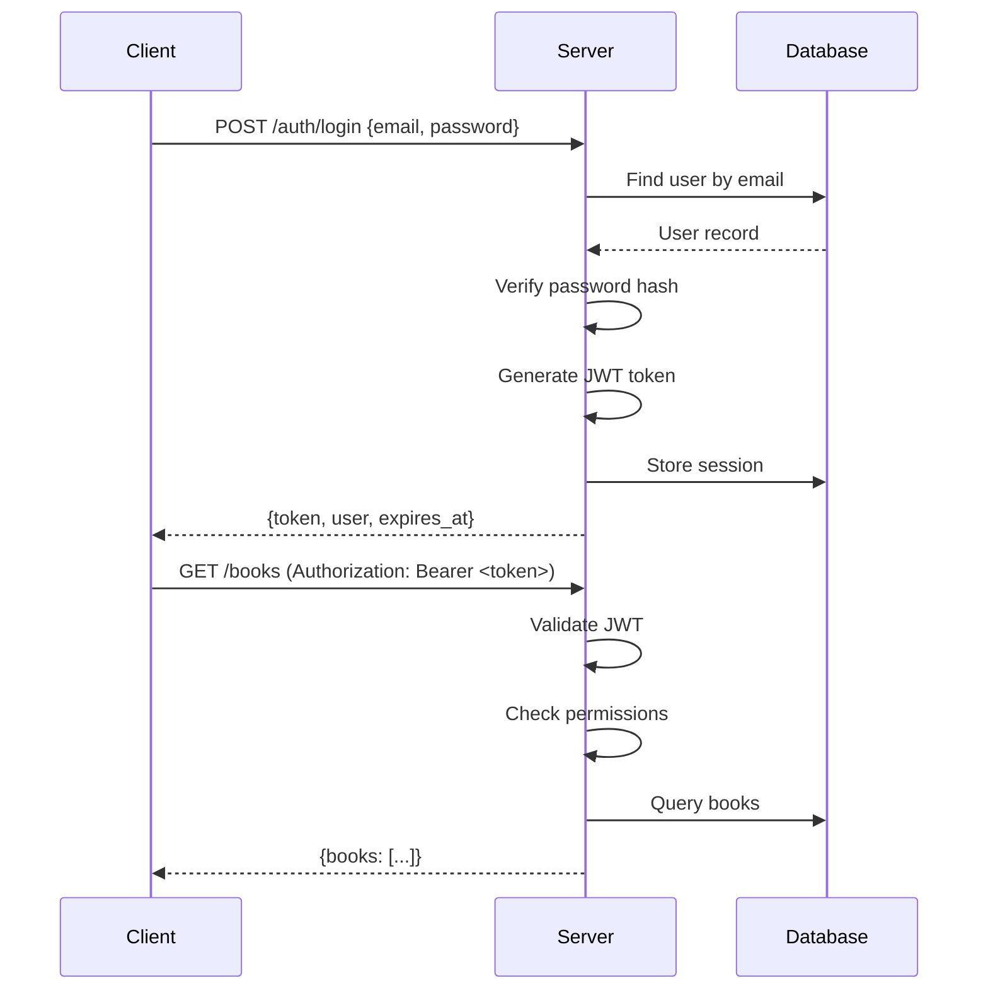

The Dust server is built with Zig and follows a modular, layered architecture with clear separation of concerns.

## Core Components

### Entry Point (`src/main.zig`)

The main entry point orchestrates the server lifecycle:

```zig
pub fn main() !void {
    // 1. Load configuration from environment
    var cfg = Config.load(allocator);
    
    // 2. Initialize database
    var db = try Database.init(allocator, db_path);
    
    // 3. Run migrations
    try db.runMigrations();
    try users.migrate(&db);
    try books.migrate(&db);
    
    // 4. Start background tasks
    const books_timer = try books.createBackgroundTimerManager(allocator, &db.db, cfg);
    
    // 5. Initialize and start HTTP server
    var server = try DustServer.init(allocator, cfg.port, &db, cfg, &should_shutdown);
    try server.listen();
}
```

Key responsibilities:
- Signal handling for graceful shutdown (`src/main.zig:15-19`)
- Configuration loading and validation
- Database initialization and migrations
- Background task registration
- Server lifecycle management

### HTTP Server (`src/server.zig`)

The `DustServer` struct manages the HTTP layer using the [httpz](https://github.com/karlseguin/http.zig) framework.

```zig
pub const DustServer = struct {
    httpz_server: httpz.Server(*ServerContext),
    context_ptr: *ServerContext,
    permission_service: *PermissionService,
    book_repo: *BookRepository,
    author_repo: *AuthorRepository,
    tag_repo: *TagRepository,
    static_server: StaticFileServer,
};
```

#### Server Context

Every request has access to a shared context defined in `src/context.zig`:

```zig
pub const ServerContext = struct {
    auth_context: AuthContext,
    permission_service: *PermissionService,
    db: *Database,
    book_repo: *BookRepository,
    author_repo: *AuthorRepository,
    tag_repo: *TagRepository,
    config: Config,
    library_directories: [][]const u8,
    static_server: *StaticFileServer,
};
```

This pattern allows route handlers to access all necessary services without global state.

#### Route Registration

Routes are registered in `setupRoutes()` (`src/server.zig:137-207`):

```zig
// Health check
router.get("/health", health, .{});

// Authentication
router.post("/auth/register", user_routes.register, .{});
router.post("/auth/login", user_routes.login, .{});
router.post("/auth/logout", user_routes.logout, .{});

// Books
router.get("/books", booksList, .{});
router.get("/books/:id", booksGet, .{});
router.get("/books/:id/stream", booksStream, .{});

// Admin
router.post("/admin/scan", adminScanLibrary, .{});
router.post("/admin/books/:id/refresh-metadata", adminRefreshBookMetadata, .{});
```

### Database Layer (`src/database.zig`)

The `Database` struct wraps the SQLite connection and provides migration support:

```zig
pub const Database = struct {
    db: sqlite.Db,
    allocator: std.mem.Allocator,
    
    pub fn init(allocator: std.mem.Allocator, path: []const u8) !Database
    pub fn runMigrations(self: *Database) !void
    pub fn hasMigration(self: *Database, name: []const u8) !bool
    pub fn recordMigration(self: *Database, name: []const u8) !void
};
```

Key features:
- Thread-safe serialized mode for concurrent access
- Migration tracking in `migrations` table
- Foreign key enforcement enabled

## Module System

Dust organizes features into self-contained modules under `src/modules/`:

### Users Module (`src/modules/users/`)

Handles authentication, authorization, and user management:

```
modules/users/
├── migrations.zig    # Database schema
├── model.zig         # User, Role, Permission models
├── auth.zig          # Authentication service
├── routes.zig        # HTTP route handlers
└── routes/
    └── admin_users.zig  # Admin user management
```

Key components:
- **UserRepository** - Database operations for users
- **AuthService** - Login, registration, password hashing
- **RoleService** - Role-based access control
- **JWT** - Token generation and validation (`src/auth/jwt.zig`)

### Books Module (`src/modules/books/`)

Manages the book library, metadata, and reading progress:

```
modules/books/
├── migrations.zig    # Books, authors, tags schema
├── model.zig         # Book, Author, Tag repositories
└── routes.zig        # Book API endpoints
```

Key components:
- **BookRepository** - Book CRUD operations and queries
- **AuthorRepository** - Author management
- **TagRepository** - Tagging system
- **Scanner** - Directory scanning (`src/scanner.zig`)
- **MetadataExtractor** - File metadata extraction (`src/metadata_extractor.zig`)
- **CoverManager** - Cover image handling (`src/cover_manager.zig`)

## Core Services

### Scanner Service (`src/scanner.zig`)

Scans configured directories for books and comics:

- Recursively walks directory tree
- Detects PDF and EPUB files
- Extracts metadata from files
- Updates database with new/changed books
- Archives removed books

Triggered on:
- Server startup
- Scheduled intervals (configurable via `SCAN_INTERVAL_MINUTES`)
- Manual admin request (`POST /admin/scan`)

### Metadata Services

<Accordion title="Metadata Extractor (src/metadata_extractor.zig)">
Extracts metadata from book files:

- **PDF**: Uses system `pdfinfo` command to extract:
  - Title, author, subject
  - Page count
  - Creation/modification dates
  
- **EPUB**: Parses `META-INF/container.xml` and OPF metadata:
  - DC metadata (title, creator, publisher, etc.)
  - Cover image path
  - ISBN from identifiers
</Accordion>

<Accordion title="External Metadata (src/openlibrary.zig)">
Fetches additional metadata from external APIs:

- **Open Library API**: Book details by ISBN
- **Google Books API**: Alternative metadata source (requires API key)

Enriches books with:
- Publication dates
- Publishers
- Descriptions
- Cover images
</Accordion>

### Cover Manager (`src/cover_manager.zig`)

Handles cover image storage and retrieval:

- Extracts covers from EPUB files
- Downloads covers from external APIs
- Stores covers in `covers/` directory
- Serves cached covers via `/covers/:id` endpoint

### Permission System

<Info>
Dust implements a flexible role-based access control (RBAC) system with granular permissions.
</Info>

Components:
- **PermissionRepository** (`src/auth/permission_repository.zig`) - Database access
- **PermissionService** (`src/auth/permission_service.zig`) - Permission checks
- **PermissionMiddleware** (`src/middleware/permission.zig`) - Route protection

Permission format: `resource.action` (e.g., `books.read`, `admin.full`)

### Static File Server (`src/static_files.zig`)

Serves the client application from `client/dist/`:

- Automatic content-type detection
- SPA fallback to `index.html` for client-side routing
- Efficient file serving with proper caching headers

## Background Tasks

The timer system (`src/timer.zig`) runs periodic background jobs:

```zig
const books_timer = try books.createBackgroundTimerManager(allocator, &db.db, cfg);
```

Tasks registered by the books module:
- **Library scanning**: Periodic directory scanning
- **Metadata refresh**: Update book metadata from external sources
- **Cleanup**: Remove stale or archived books

Interval configuration:
- `SCAN_INTERVAL_MINUTES` - Library scan frequency (default: 5)
- `CLEANUP_INTERVAL_MINUTES` - Cleanup task frequency (default: 60)

## Authentication Flow



Implementation:
1. Client sends credentials to `/auth/login` (`src/modules/users/routes.zig`)
2. Server verifies password using bcrypt
3. JWT token generated with user ID and permissions (`src/auth/jwt.zig`)
4. Token returned to client with expiration
5. Client includes token in `Authorization: Bearer <token>` header
6. Middleware validates token on protected routes (`src/middleware/helpers.zig`)

## Error Handling

Dust uses Zig's error union types for robust error handling:

```zig
// Functions return error unions
pub fn getBook(id: i64) !Book {
    return db.queryOne(Book, "SELECT * FROM books WHERE id = ?", .{id}) 
        catch |err| return error.BookNotFound;
}

// Errors propagate up the call stack
try getBook(book_id);
```

HTTP error responses:
- 400 Bad Request - Invalid input
- 401 Unauthorized - Missing/invalid token
- 403 Forbidden - Insufficient permissions
- 404 Not Found - Resource not found
- 500 Internal Server Error - Unexpected errors

## Thread Safety

SQLite connection uses serialized threading mode for thread safety:

```zig
const db = try sqlite.Db.init(.{
    .mode = .{ .File = path_z },
    .threading_mode = .Serialized,
});
```

<Note>
For production deployments with high concurrency, consider implementing a connection pool where each worker thread has its own database connection.
</Note>

## Build and Deployment

Build configuration in `build.zig`:

```bash
# Development build
zig build

# Production build (optimized)
zig build -Doptimize=ReleaseFast

# Run tests
zig build test
```

The server binary is self-contained with no runtime dependencies except:
- SQLite (statically linked)
- System libraries (libc)
- Optional: `pdfinfo` for PDF metadata extraction