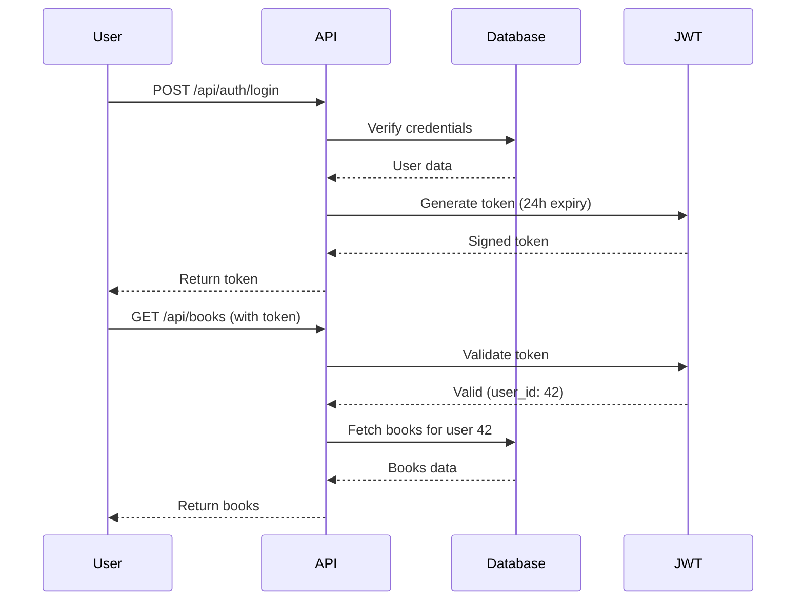

Dust provides secure user authentication with JWT tokens, bcrypt password hashing, and an invitation-based registration system.

## Authentication Overview

Dust uses industry-standard security practices:

- **Password Hashing**: Bcrypt with 12 rounds (cost factor 2^12)
- **Session Management**: JWT tokens with HMAC-SHA256 signatures
- **Invitation System**: Time-limited, cryptographically signed invitation tokens
- **Role-Based Access**: Admin and user roles with different permissions

<Info>
Dust is designed for self-hosted deployment. The first user to register automatically becomes an admin.
</Info>

## User Registration

Dust supports two registration methods:

### First User (Admin)

The first user to register on a new Dust instance automatically receives admin privileges:

```zig
// First user check
const user_count = try auth_service.user_repo.countUsers();
const is_first_user = user_count == 0;

if (is_first_user) {
    try user_repo.assignRole(user_id, "admin");
}
```

<Steps>
  <Step title="Install Dust">
    Deploy Dust to your server for the first time.
  </Step>
  
  <Step title="Navigate to registration">
    Visit `/register` in your web browser.
  </Step>
  
  <Step title="Create admin account">
    Enter your email and password. You'll automatically become the admin.
  </Step>
  
  <Step title="Invite other users">
    Use the admin panel to send invitation links to additional users.
  </Step>
</Steps>

### Invited Users

After the first user, all new registrations require an invitation:

1. Admin generates an invitation for an email address
2. User receives a time-limited invitation link
3. User clicks the link and sets their password
4. User is created with standard (non-admin) privileges

## Login Flow

Users authenticate with email and password:

<Steps>
  <Step title="Submit credentials">
    User sends email and password to `/api/auth/login`.
  </Step>
  
  <Step title="Verify password">
    Dust verifies the password against the stored bcrypt hash.
  </Step>
  
  <Step title="Issue JWT token">
    If credentials are valid, Dust issues a JWT token valid for 24 hours.
  </Step>
  
  <Step title="Store token">
    Client stores the JWT token (typically in localStorage or httpOnly cookie).
  </Step>
</Steps>

### Login API

```http
POST /api/auth/login
Content-Type: application/json

{
  "email": "user@example.com",
  "password": "your-password"
}
```

Response:
```json
{
  "token": "eyJhbGciOiJIUzI1NiIsInR5cCI6IkpXVCJ9...",
  "user": {
    "id": 42,
    "email": "user@example.com",
    "username": "alice",
    "is_admin": false
  }
}
```

<Warning>
Tokens expire after 24 hours. Implement token refresh or re-authentication in your client application.
</Warning>

## JWT Tokens

Dust uses JWT (JSON Web Tokens) for stateless authentication.

### Token Structure

```
header.payload.signature
```

The payload contains:

```json
{
  "user_id": 42,
  "email": "user@example.com",
  "username": "alice",
  "iat": 1705334400,  // Issued at (Unix timestamp)
  "exp": 1705420800   // Expires at (Unix timestamp)
}
```

### Token Validation

On each API request:

1. Client sends token in `Authorization: Bearer <token>` header
2. Dust validates the HMAC-SHA256 signature
3. Dust checks the expiration timestamp
4. If valid, the request proceeds with the user's identity

<Note>
JWT tokens are signed with your `JWT_SECRET` environment variable. Keep this secret secure and never commit it to version control.
</Note>

## Password Security

Dust uses bcrypt for password hashing:

```zig
pub fn hashPassword(self: *AuthService, password: []const u8) ![128]u8 {
    var hash: [128]u8 = [_]u8{0} ** 128;
    
    _ = try std.crypto.pwhash.bcrypt.strHash(
        password,
        .{
            .allocator = std.heap.page_allocator,
            .params = .{
                .rounds_log = 12,  // 2^12 = 4096 rounds
                .silently_truncate_password = false,
            },
            .encoding = .crypt,
        },
        &hash,
    );
    
    return hash;
}
```

### Password Requirements

While Dust doesn't enforce minimum requirements by default, consider implementing:

- Minimum 12 characters
- Mix of uppercase, lowercase, numbers, and symbols
- No common passwords (check against known password lists)
- No reuse of previous passwords

<Tip>
Implement password requirements in your frontend or API layer before calling Dust's auth service.
</Tip>

## Invitation System

Admins can invite users with cryptographically signed invitation tokens.

### How Invitations Work

<Accordion title="Token Generation">
  ```zig
  // Generates a signed invitation token
  const token = try invitation.generateToken(
      allocator,
      secret,
      email
  );
  ```
  
  The token contains:
  - Email address (who can use this invitation)
  - Expiration timestamp (24 hours from creation)
  - HMAC-SHA256 signature (prevents tampering)
</Accordion>

<Accordion title="Token Format">
  ```
  base64url("email|expiration") + "." + base64url(hmac_signature)
  ```
  
  Example:
  ```
  dXNlckBleGFtcGxlLmNvbXwxNzA1NDIwODAw.SGVsbG8gV29ybGQK
  ```
</Accordion>

<Accordion title="Token Verification">
  When a user clicks an invitation link:
  
  1. Dust extracts the email and expiration from the token
  2. Recomputes the HMAC signature using the JWT secret
  3. Compares signatures (constant-time comparison prevents timing attacks)
  4. Checks if the token has expired
  5. Verifies the email matches the claimed recipient
</Accordion>

### Creating Invitations

```http
POST /api/admin/invitations
Authorization: Bearer <admin-token>
Content-Type: application/json

{
  "email": "newuser@example.com"
}
```

Response:
```json
{
  "invitation_url": "https://your-dust-server.com/register?token=...",
  "expires_at": "2024-01-16T14:32:00Z"
}
```

<Warning>
Invitation links expire after 24 hours for security. Users must complete registration before expiration.
</Warning>

## Roles and Permissions

Dust supports two user roles:

### Admin

- Create invitation links
- View all users
- Delete users
- Trigger library scans
- Modify server settings
- Archive/unarchive books

### User (Standard)

- View books
- Track reading progress
- Add/remove personal tags
- Download books they have access to
- Manage their own account settings

<Info>
Dust's permission system is designed to be extended. You can add custom roles by modifying the `user_roles` table.
</Info>

## Security Best Practices

<Tip>
**Use strong JWT secrets**: Generate a random 256-bit secret for `JWT_SECRET`. Never use a guessable value.
</Tip>

<Tip>
**Enable HTTPS**: Always deploy Dust behind HTTPS to protect tokens in transit.
</Tip>

<Tip>
**Rotate secrets periodically**: Change your JWT secret every 90 days (this will invalidate all active sessions).
</Tip>

<Tip>
**Monitor failed logins**: Implement rate limiting or account lockouts after repeated failed login attempts.
</Tip>

<Tip>
**Audit invitation usage**: Track who created invitations and who accepted them.
</Tip>

## Token Lifecycle



## Authentication Configuration

Set these environment variables:

```bash
# Required
JWT_SECRET=your-256-bit-secret-here

# Optional
JWT_EXPIRY_HOURS=24
INVITATION_EXPIRY_HOURS=24
BCRYPT_ROUNDS=12
```

<Warning>
Never commit secrets to version control. Use environment variables or a secrets management system.
</Warning>

## Testing Authentication

Dust includes comprehensive tests for authentication:

```bash
# Run auth tests
zig test src/auth/jwt.zig
zig test src/modules/users/invitation.zig
zig test src/modules/users/auth.zig
```

Key test scenarios:
- JWT round-trip (create and validate)
- Expired token rejection
- Invitation generation and verification
- Password hashing and verification
- Tampered token detection